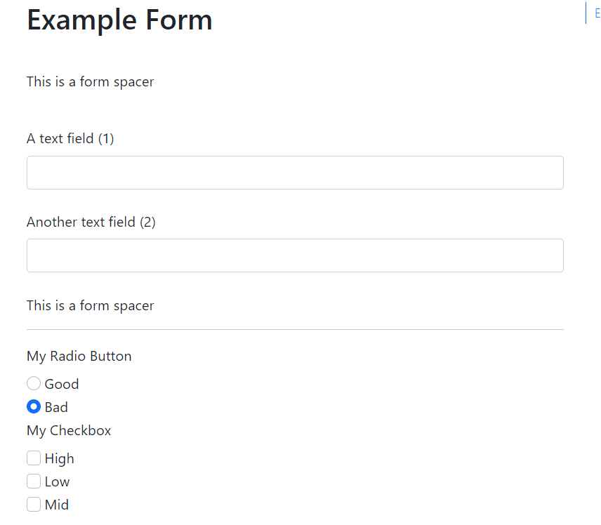

# Forms Extension For Quarto

This extension allows you to add an HTML form to your Quarto HTML pages, using the the `form` shortcode

## Installing

```bash
quarto install extension jlgraves-ubc/forms
```
This will install the extension under the `_extensions` subdirectory.
If you're using version control, you will want to check in this directory.

## Using

The forms extension has two parts:

1) A set of metadata, in the document header, which defines the form's part
2) A shortcode `` which embeds it in the appropriate place in the document.

## Form Definition

You define a form using the metadata in the document header, as follows:

```yaml
---
filters:
  - jlgraves-ubc/forms
form:
  action: "/action.js"
  submit: "Submit Now!"
  method: "GET"
  fields:
  - name: "A Text Field"
  - type: "text"
  - id: "textfield1" 
---
```

Fields which take multiple entry values take a `values` parameter, which looks like:

```yaml
  - name: Checkbox
    type: checkbox
    id: checkbox1
    label: "My Checkbox"
    values:
    - text: "High"
      value: "hi"
    - text: "Low"
      value: "lo"
    - text: "Mid"
      value: "mid"
```

You can see more detailed (and better-formatted) documentation in the example, below.

## Example

Here is the source code for a minimal example: [example.qmd](example.qmd).




# Contributing

This project is open and welcome contributions.  Here are a couple of things you could do:

* Modify all of the HTML classes to use variables instead of built-ins, to make the easier to manage or adjust
* Add some of the rarer form elements I didn't already code
* Create support for `<legend>` items in the form
* Add a `placeholder` parameter
* Write tests for key functionality
* Add form display options for subtext

Just submit a pull request!
